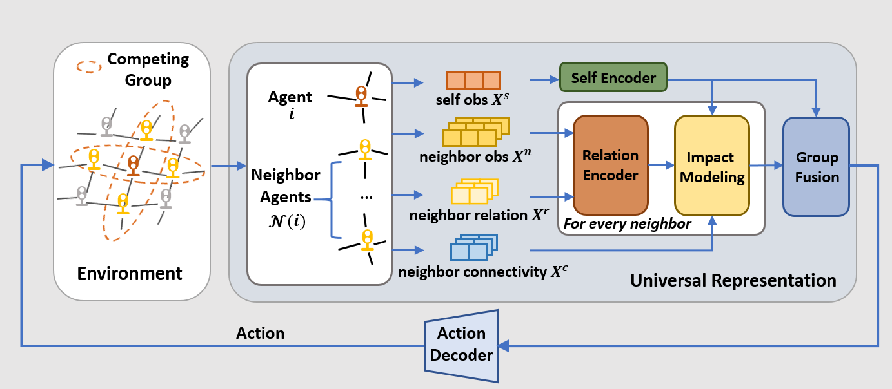

# CityLight

This repo is the official implementation for the paper   
CityLight: A Universal Model Towards Real-world City-scale Traffic Signal Control Coordination.

## Overall architecture
This work aims to achieve traffic signal control coordination for city-scale real-world heterogeneous intersections. Built on the parameter-sharing MAPPO framework, CityLight learns an aligned representation for different intersection configurations and their complex neighbor-wise relative impacts. In this way, the policy network learns a universal policy that fit heterogeneous intersections with intricate neighborhood impacts. 



## Data
We use two region-scale datasets and two city-scale datasets to extensively evaluate Citylight against the state-of-the-art baselines. The overall statistics of the datasets is shown in the following table. 

| Datasets                 | Chaoyang  | Central Beijing | Beijing    | Jinan     |
|--------------------------|-----------|-----------------|------------|-----------|
| \#Intersections          | 97        | 885             | 13952      | 4064      |
| \#Three-phase intersections | 49        | 630             | 9752       | 2466      |
| \#Four-phase intersections | 48        | 255             | 4200       | 1595      |
| \#Roads                  | 608       | 4640            | 76806      | 23950     |
| Covered Area             | 14.2 km²  | 79.3 km²        | 3104.4 km² | 1477.5 km²|
| \#Agents                 | 9000      | 55429           | 143298     | 99712     |


Due to the size limit of github, we have stored the data in an anonymous google drive link: https://drive.google.com/drive/folders/1LxsdybT5Ai1AUjGT4m6Ku-951zEehU7Y?usp=drive_link.

## Installation
### Environment
- Tested OS: Linux
- Python >= 3.8
- torch == 2.2.1
- Tensorboard
  
### Dependency for Simulation Environment
To achieve high-fidelity city-scale traffic simulation, we incorporate MOSS (MObility Simulation System) as our simulation environment. The detailed introduction of MOSS can be refered to in: https://arxiv.org/abs/2405.12520. The installation process of MOSS is detailed in: https://github.com/tsinghua-fib-lab/moss?tab=readme-ov-file. 

### Other Dependencies
1. Install Pytorch with the correct CUDA version.
2. Use the ```pip install -r requirements.txt``` command all other Python modules and packages used in this project.


## Config 
Configs for performance reproductions on the four datasets. 
### Chaoyang
```
python main.py --data data/beijing_chaoyang --steps 3600 --lr 5e-4 --critic_lr 5e-4 --buffer_episode_size 60 --cuda_id 0 --ppo_epoch 16 --training_step 10000000 --algo mp_builtin --interval 15 --agg 1 --attn type_attn --distance 2 --reward one_hop_queue --num_mini_batch 6 --layer_N 2 
```

### Central Beijing
```
python main.py --data data/central_beijing --steps 3600 --lr 5e-4 --critic_lr 5e-4 --buffer_episode_size 12 --cuda_id 0 --ppo_epoch 16 --training_step 10000000 --algo mp_builtin --interval 15 --agg 1 --attn type_attn --distance 2 --reward one_hop_queue --num_mini_batch 4 --layer_N 2 
```

### Jinan
```
python main.py --data data/jinan --steps 3600 --lr 5e-4 --critic_lr 5e-4 --buffer_episode_size 12 --cuda_id 0 --ppo_epoch 10 --training_step 10000000 --algo mp_builtin --interval 15 --agg 1 --attn type_attn --distance 2 --reward one_hop_queue --num_mini_batch 18 --layer_N 2 
```

### Beijing
```
python main.py --data data/beijing --steps 3600 --lr 5e-4 --critic_lr 5e-4 --buffer_episode_size 4 --cuda_id 0 --ppo_epoch 10 --training_step 10000000 --algo mp_builtin --interval 15 --agg 1 --attn type_attn --distance 2 --reward one_hop_queue --num_mini_batch 18 --layer_N 2 
```

